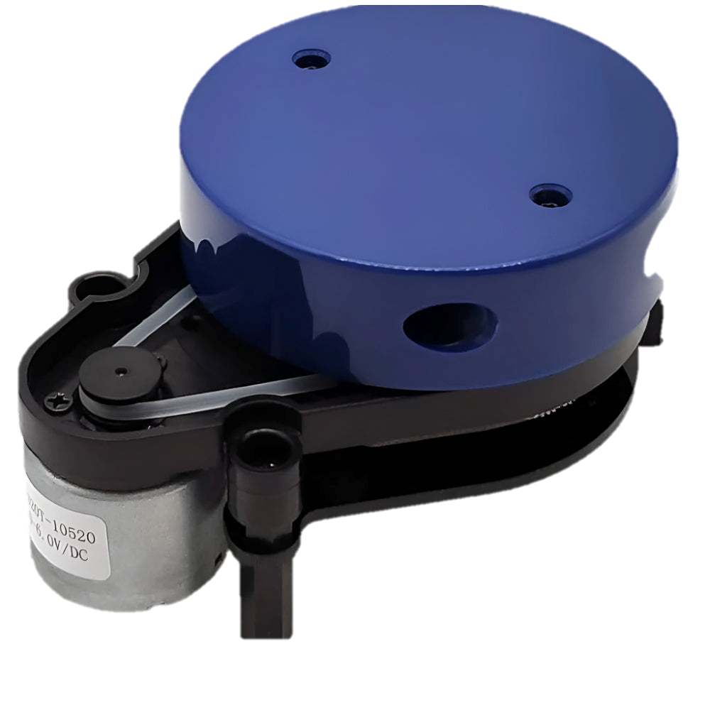
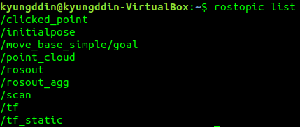
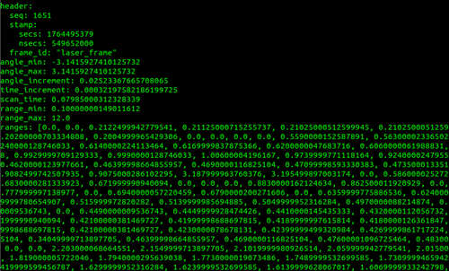
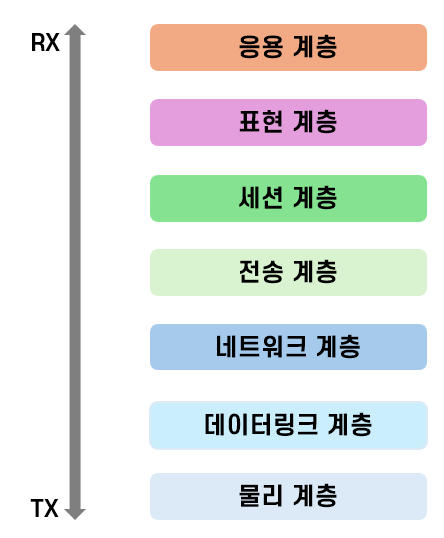
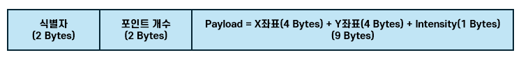
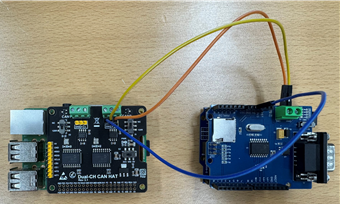
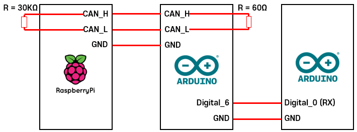
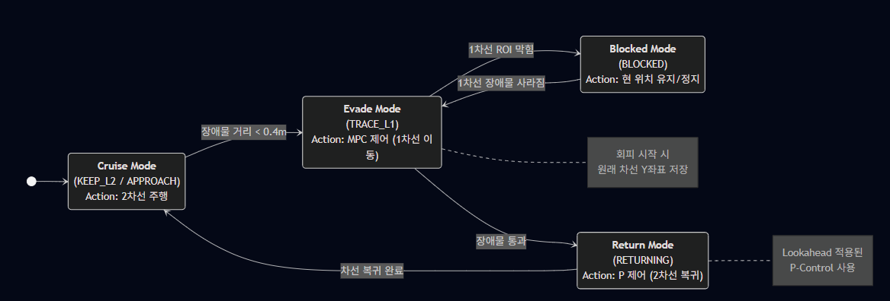
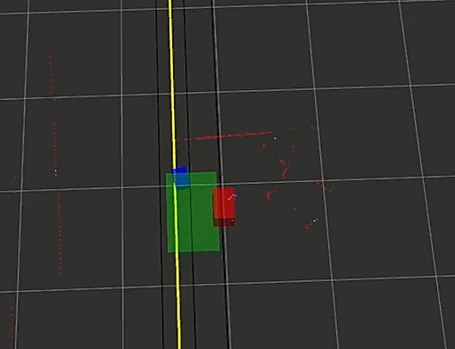

## LiDAR 기반 자율주행 차량의 지능형 장애물 회피 및 차선 복귀 제어 시스템 개발

25-2학기 중앙대학교 전자전기공학부 종합설계 작품

## Abstraction

본 프로젝트에서는 Infra LiDAR 센서와 ROS 미들웨어를 활용하여 2차선 도로 환경에서 장애물을 능동적으로 회피하고 차선으로 복귀하는 지능형 자율주행 제어 시스템을 제안한다. 대용량 센서 데이터의 실시간 전송을 위해 VPN 기반의 UDP 소켓 통신을 구축하였으며, 제어 명령의 신뢰성을 위해 임피던스 매칭이 최적화된 CAN 통신 네트워크를 설계하였다. 제어 알고리즘으로는 주행 안정성을 위해 MPC(Model Predictive Control)와 PID 제어를 혼합한 하이브리드 방식을 적용하였으며, ROS 기반의 시뮬레이션을 통해 시스템의 유효성과 통신 안정성을 검증하였다.

## 1. Introduction

### Purpose
- 최근 자율주행차(Smart Driving Vehicle, SDV)의 보급 및 연구가 가속화되면서 차량 내 전장 장치 간의 신뢰성 높은 데이터 교환과 정확한 주변 환경 인지가 핵심 기술로 부상하고 있다. 이와 관련해서 기존의 통신 프로토콜을 차량용 환경에 맞게 개선하거나 다양한 센서를 활용하여 주변 정보를 고정밀로 수집하기 위한 연구가 활발히 이루어지고 있으며, 이를 통해 차량의 주행 안정성과 의사결정 정확도를 향상시키기 위한 기술적 기반이 지속적으로 강화되고 있다.

### CAN

- CAN(Controller Area Network) 통신은 오랜 기간 표준으로 자리 잡아 왔으며, 높은 내구성과 오류 검출 능력을 바탕으로 차량 내 전자 제어 장치(Electronic Control Unit, ECU)간 통신을 위한 필수적인 프로토콜로 활용되고 있다. 차량 내 통신량 증가에 따라 차량용 Ethernet과 같은 기술들이 부상하고 있지만, 실시간 제어를 위한 하위 네트워크 구성 요소로서 CAN은 계속해서 발전해오고 있다.

### LiDAR
- LiDAR(Light Detection and Ranging) 센서는 레이저 펄스를 방출한 뒤 그 반사 신호를 분석하여 주변 공간 정보를 정밀하게 수집하는 데 특화된 센서이다. 일부 기업들은 여전히 카메라 기반 영상 정보를 중심으로 한 자율주행 개발 전략을 고수하고 있으나, 다수의 자율주행 기술 기업들은 차세대 핵심 센서로서 LiDAR의 잠재력을 주목하며 이를 이용한 환경 인지 기술을 적극적으로 연구하고 도입하고 있다.

### Communication System
- 성공적인 자율주행 시스템 구현을 위해서는 센서 데이터의 고속 처리와 안정적인 제어 명령 전달이 필수적이다. 이에 본 연구에서는 LiDAR가 수집한 대용량의 Point Cloud 데이터를 PC와 임베디드 제어기 간에 지연 없이 전송하기 위해, 연결 지향형인 TCP 대신 실시간성이 우수한 전송 계층의 UDP(User Datagram Protocol) Socket 통신을 적용하였다. 또한, 상위 제어기인 Raspberry Pi에서의 연산된 조향 및 속도 제어 명령을 하위 구동기인 Arduino 및 Motor로 전달하는 과정에서 차량용 네트워크 표준인 CAN 통신을 구축하여 데이터 전송의 신뢰성을 확보하였다.

### ROS with Other Part
- 제어 알고리즘 측면에서는 ROS(Robot Operating System) Noetic 환경을 기반으로 시스템을 구성하였으며, 수집된 거리 데이터를 분석하여 장애물 유무를 판단한다. 장애물이 감지될 경우, 차량의 동역학적 제약을 고려한 MPC(Model Predictive Control) 기법을 통해 최적의 회피 경로를 생성하여 주행하고, 회피 이후에는 PID 제어를 통해 신속하고 안정적으로 원래 차선으로 복귀하는 알고리즘을 시뮬레이션하였다.

### So..
- 본 프로젝트에서는 이러한 기술적 흐름에 발맞추어, Infra LiDAR 센서를 활용하여 2차선 도로 환경의 정보를 실시간으로 수집하고, 전방 장애물을 능동적으로 회피한 후 본래 차선으로 복귀하는 지능형 자율주행 제어 시스템을 설계 및 구현하였다. 또한, 시스템의 유효성을 검증하기 위해 ROS기반의 주행 시뮬레이션을 수행하여 제어 로직의 동작을 확인하고, 이를 실제 제작된 RC카 플랫폼에 적용하여 통신 성능과 주행 안정성을 입증하는 것을 목적으로 한다.

## 2. Infra LiDAR Environment Setting

### 2.1. ROS Middleware & Docker

- 본 프로젝트에서는 자율주행 시스템의 핵심 센서인 LiDAR 데이터를 효율적으로 처리하기 위해 로봇 Middleware인 ROS(Robot Operating System) Noetic 버전을 사용하였다. Infra LiDAR 시스템은 2차선 도로 정보를 실시간으로 수집하여 자율주행 차량에 전달하는 역할을 수행한다. LiDAR 센서(YDLiDAR X2)는 PC와 USB 인터페이스를 통해 UART 시리얼 통신으로 연결되며, ROS의 노드(Node) 구조를 활용하여 하드웨어 추상화를 구현하였다. 이를 통해 하드웨어 종속성을 줄이고, 다양한 프로세스 간의 데이터 통신을 토픽(Topic)이라는 메시지 형태로 주고받을 수 있는 환경을 구축하였다.

- 일반적으로 임베디드 리눅스 환경에서는 다수의 센서와 라이브러리를 연동하는 과정에서 패키지 간의 의존성 충돌(Dependency Conflict)이나 OS 업데이트에 따른 버전 호환성 문제가 빈번하게 발생한다. 특히 ROS Noetic은 Ubuntu 20.04 및 특정 Python 버전(Python 3.8 등)에 종속적이기 때문에, 호스트 OS의 변경으로부터 개발 환경을 보호할 필요가 있다.

- 이에 본 연구에서는 Docker 컨테이너 기술을 도입하여 ROS 구동 환경을 가상화하였다. Docker를 활용함으로써 ROS Core, 통신 노드(Node), 그리고 필수 드라이버가 설치된 독립적인 이미지(Image)를 빌드하여 컨테이너화하였으며, 이를 통해 호스트 시스템의 환경 변화와 무관하게 동일한 동작을 보장하는 시스템 안정성을 확보하였다. 또한, 개발 단계에서 검증된 패키지 버전을 그대로 배포 및 관리할 수 있어, 협업 및 유지보수 측면에서의 효율성을 극대화하였다.

### 2.2. Data Parsing with ROS Topic

- LiDAR 센서로부터 수집된 Raw 데이터는 ROS의 표준 메시지 타입인 sensor_msgs/LaserScan 형태로 발행(Publish)된다. 본 연구에서는 /scan 토픽을 구독(Publish)하여 데이터를 취득하였다. 데이터 파싱을 위해 Python 라이브러리인 rospy를 활용하였으며, /scan 메시지에 포함된 여러 정보 중 장애물 및 차선 인식에 필수적인 거리 정보(range)와 반사 강도(intensity) 데이터를 추출하였다. ranges 데이터는 센서를 중심으로 360도 전방위의 거리 값을 배열 형태로 포함하고 있으며, 유효 거리(0.5 m ~ 50 m) 내의 데이터만을 필터링하여 노이즈를 제거하는 전처리 과정을 거쳤다.

### 2.3. Coordinate Transformation: Polar to Cartesian

- LiDAR 센서의 /scan 토픽은 기본적으로 거리(r)와 각도(θ)를 기반으로 하는 극좌표계(Polar Coordinate System) 데이터를 출력한다. 그러나 자율주행 차량의 경로 계획 및 제어를 위해서는 이를 직교 좌표계(Cartesian Coordinate System)로 변환해야 한다. 따라서 본 시스템에서는 수신된 각 포인트의 거리 값(r)과 해당 인덱스의 각도 값(θ)을 이용하여 2차원 평면 좌표(x,y)로 변환하는 알고리즘을 적용하였다.

- 변환된 좌표 데이터는 차량을 기준으로 한 장애물의 상대 위치를 나타내며, 이후 장애물 회피 알고리즘의 입력 데이터로 활용된다.

## 3. UDP Socket Communication

### 3.1. OSI 7 Layer Network Model

- 자율주행 시스템 내의 데이터 통신을 설계하기 위해 OSI 7 계층 모델을 참조하였다. 본 프로젝트에서는 물리 계층(Physical Layer)과 데이터 링크 계층(Data Link Layer) 위에 IP 기반의 네트워크 계층(Network Layer)을 구성하고, 전송 계층(Transport Layer)에서 프로세스 간 통신을 수행한다. 응용 계층(Application Layer)에서는 파싱된 LiDAR 데이터를 정의된 패킷 구조에 담아 전송하는 역할을 수행한다.

### 3.2. TCP & UDP

- TCP(Transmission Control Protocol)
    - TCP는 연결 지향형 프로토콜로, 패킷의 전송 순서를 보장하고 손실된 패킷의 재전송을 요청하여 높은 신뢰성을 제공한다. 그러나 이러한 연결 설정(3-way handshake)과 흐름 제어 과정은 실시간 데이터 전송에 있어 지연을 발생시킬 수 있다.

- UDP(User Datagram Protocol)
    - UDP는 비연결형 프로토콜로, 데이터 전송 전 연결 설정 과정이 없으며 수신 여부를 확인하지 않는다. 본 시스템에서 다루는 LiDAR 데이터는 초당 수천 개의 포인트가 발생하며, 일부 패킷이 유실되더라도 최신 데이터를 빠르게 수신하는 것이 제어의 실시간성 확보에 더욱 중요하다. 따라서 본 연구에서는 신뢰성보다는 전송 속도와 효율성을 우선시하여 전송 계층 프로토콜로 UDP를 채택하였다.

### 3.3. UDP Socket Communication Structure

- TX(Transmitter)
    - Infra LiDAR가 연결된 PC 측에서는 파싱된 좌표 데이터를 UDP 패킷으로 패킹(Packing)하여 자율주행 차량의 IP 주소로 전송한다. Python의 socket 라이브러리를 사용하여 SOCK_DGRAM 타입의 Socket을 생성하고, 설정된 타겟 IP와 포트 번호로 데이터를 송신한다.

- RX(Receiver)
    - 자율주행 차량의 메인 제어기(Raspberry Pi)에서는 UDP Socket을 바인딩(Binding)하여 대기 상태를 유지한다. 데이터가 수신되면 버퍼에서 패킷을 읽어 들이고, 사전에 정의된 헤더를 확인하여 유효한 데이터인지 검증한 후 좌표 정보를 복원한다.

- VPN
    - 본 프로젝트는 교내 공용 WiFi(Smart-CAU) 환경에서 진행되었다. 공용 네트워크는 DHCP(Dynamic Host Configuration Protocol)를 사용하여 기기 접속 시마다 IP 주소가 동적으로 변경되는 문제가 있었다. 이는 고정된 IP로 통신해야 하는 UDP Socket 통신에 치명적이다. 이를 해결하기 위해 가상 사설망(VPN) 솔루션인 ZeroTier를 도입하였다. ZeroTier를 통해 PC와 Raspberry Pi를 동일한 가상 네트워크 대역(172.23.xxx.xxx)으로 묶어 고정 IP를 할당함으로써, 물리적 네트워크 환경 변화와 무관하게 안정적인 통신 채널을 확보하였다.

- UDP Datagram Structure

    - 전송 효율을 높이기 위해 데이터 패킷 구조를 최적화하였다. 패킷은 헤더(Header)와 페이로드(Payload)로 구성되며, 리틀 엔디안(Little Endian) 방식으로 직렬화하였다.
        - Header (4 Bytes): 패킷의 시작을 알리는 식별자 0xAA, 0x55 (2 Bytes)와 포함된 포인트의 개수 (2 Bytes)로 구성된다.
        - Payload (9 Bytes per Point): 각 포인트는 X좌표(float, 4 Bytes), Y좌표(float, 4 Bytes), 반사 강도(uint8, 1 Bytes)로 구성된다.
    - 전체 패킷의 크기는 4 + (9 × 포인트 개수) 바이트가 되며, 이를 한 번의 데이터그램으로 전송하여 오버헤드를 최소화하였다.

## 4. CAN

### 4.1. Circuit Connection and Components

- 자율주행 차량의 제어 명령을 전달하기 위해 차량용 네트워크 표준인 CAN(Controller Area Network) 통신을 사용하였다. 메인 제어기인 Raspberry Pi에는 'Dual-CH CAN HAT' 확장 보드를 장착하여 CAN 트랜시버(MCP2515) 기능을 수행하게 하였으며, 하위 제어기인 Arduino UNO에는 CAN-BUS Shield를 연결하였다. CAN High와 CAN Low 라인 사이에는 신호 반사를 방지하기 위해 120 Ω의 종단 저항을 필요로 하는데, Raspberry Pi의 확장 보드에서는 이러한 종단 저항을 점퍼 스위치를 활성화하는 것으로 종단 저항 추가가 가능하였다.

### 4.2. CAN Pipeline

- 데이터 처리 부하를 분산하고 실시간 제어를 수행하기 위해 다음과 같은 파이프라인을 구축하였다.
    - Raspberry Pi (Main Controller): 센서 데이터를 기반으로 목표 조향각과 속도를 연산하여 CAN 메시지를 생성 및 송신한다.
    - Arduino UNO 1 (CAN Receiver): CAN 버스를 통해 메시지를 수신하고, 데이터 무결성을 확인한 뒤 이를 별도의 연산 없이 UART 통신을 통해 구동 모터가 연결된 하위 제어기(Arduino UNO 2)로 바이패스(Relay)하는 역할을 수행한다.
    - Arduino UNO 2 & BLDC Motor: 메모리 및 핀맵 한계 등을 고려하여 추가적인 Arduino 보드를 UART로 연결하거나, 모터 드라이버에 직접 신호를 인가하여 차량을 구동한다.

### 4.3. Impedence Matching & Overcurrent Protection

- CAN 통신 시스템 구축 초기, 데이터 패킷이 간헐적으로 유실되거나 통신 연결이 불안정한 현상이 발생하였다. 이를 해결하기 위해 물리 계층의 회로 특성을 분석한 결과, 종단 저항의 임피던스 매칭 오류로 인한 과전류가 원인임을 파악하였다.일반적인 CAN 통신 표준(ISO 11898)은 버스 양단에 각각 120 Ω의 저항을 배치하여 전체 버스 임피던스를 60 Ω으로 유지할 것을 권장한다. 그러나 본 연구에 사용된 Arduino CAN Shield의 회로를 측정한 결과, 단일 모듈에 이미 60 Ω의 저항이 내장되어 있음을 확인하였다. 이는 제조사가 복잡한 종단 저항 구성 없이 단독 연결만으로도 1:1 통신이 가능하도록 교육적 편의를 위해 설계한 것으로 추정된다.문제는 Raspberry Pi 측의 CAN HAT 확장 보드에서도 120 Ω 종단 저항 점퍼를 활성화(Enable)했을 때 발생하였다. 두 저항이 병렬로 연결됨에 따라 전체 합성 저항은 다음 40 Ω으로 감소하였다.

- 표준치(60 Ω)보다 현저히 낮은 40 Ω의 부하 저항은 CAN Transceiver 구동 시 과도한 전류를 유발하였으며, 이는 신호 전압 레벨의 감쇠와 통신 장애의 주된 원인이 되었다. 이를 해결하기 위해 Raspberry Pi CAN HAT의 종단 저항 점퍼를 제거하여 비활성화하였다. 점퍼 제거 후 Raspberry Pi 측의 저항을 측정한 결과 약 30 kΩ으로 측정되었으며, 이는 버스 라인에 영향을 주지 않는 하이 임피던스(High-Z) 상태임을 의미한다. 결과적으로 전체 CAN 버스의 임피던스는 Arduino Shield의 고유 저항인 60 Ω으로 매칭되었다. 이를 통해 트랜시버에 흐르는 과전류를 방지하고 신호 무결성을 확보하여 안정적인 통신 환경을 구축하였다.

## 5. ROS Driving Simulation

### 5.1. FSM

- 본 프로젝트에서는 전방 장애물 유무와 주변 차선(1차선)의 여유 공간 상태에 따라 자율주행 차량의 제어 모드를 결정하기 위해 다음과 같은 유한 상태 머신(FSM)을 설계하였다. 시스템은 기본적으로 2차선 주행을 유지하며, 센서 데이터를 기반으로 Cruise, Evade, Blocked, Return의 4가지 상태로 천이한다.

- 각 State 설명
    - State 1: Cruise & Approach (KEEP_L2)
        - 동작: 장애물이 감지되지 않거나, 장애물이 감지되었더라도 회피 임계 거리(0.4 m) 이외에 있을 때의 상태이다. 
        - 제어: 차량은 초기 설정된 2차선 중심(y = 0.175 m)을 유지하며 0.6 m/s의 속도로 정속 주행한다. 
        - 천이 조건: 전방 장애물과의 거리(front_gap)가 0.4 m 미만으로 줄어들면 Evade 상태로 천이한다.
    - State 2: Evade Mode (TRACE_L1)
        - 동작: 전방 장애물 충돌 위험이 감지되어 1차선으로 차선을 변경하는 상태이다. 이때 시스템은 회피 직전의 본래 차선 위치(saved_return_y)를 메모리에 저장한다.
        - 제어: MPC(Model Predictive Control) 알고리즘이 활성화되어 1차선 목표 좌표(y = 0.475 m)로 향하는 최적 조향각을 계산한다.
        - 천이 조건:1차선 ROI(Region of Interest) 영역에 장애물이 감지되면 Blocked 상태로 천이한다. 장애물을 완전히 통과하여 front_gap 데이터가 사라지면(None) Return 상태로 천이한다.
    - State 3: : Emergency Stop (BLOCKED)
        - 동작: 전방에 장애물이 있어 회피해야 하지만, 회피하려는 1차선 공간(ROI)에도 장애물이 존재하여 진입이 불가능한 상태이다.
        - 제어: 무리한 차선 변경 시 충돌 위험이 있으므로, 조향을 멈추고 현 차선을 유지하거나 정지한다.
    - State 4: Return Mode (RETURNING)
        - 동작: 장애물 회피가 완료된 후, 저장해 두었던 원래 차선(y = 0.175 m)으로 복귀하는 상태이다.
        - 제어: 빠른 연산과 안정적인 복귀를 위해 MPC 대신 Lookahead 기반의 P(Proportional) 제어기를 사용한다. Lookahead 거리(0.8 m) 앞의 예측 지점과 목표 차선 간의 오차를 계산하여 부드러운 복귀 궤적을 생성한다.
        - 천이 조건: 차량의 현재 위치와 목표 차선 간의 오차가 0.1 m 이내로 줄어들면 복귀가 완료된 것으로 판단하여 다시 Cruise 상태로 천이한다.

### 5.2. ROS Marker & Rviz Environment

- 시뮬레이션 검증을 위해 ROS의 시각화 도구인 Rviz를 활용하였다. 가상의 차량 모델과 차선, 장애물을 visualization_msgs/Marker 토픽으로 정의하여 3차원 공간상에 시각화하였다. 이를 통해 센서 데이터의 정합성과 제어 알고리즘의 동작(경로 생성, 조향각 변화)을 실시간으로 모니터링할 수 있는 환경을 구축하였다.

### 5.3. ROS Simulation

- 본 프로젝트에서는 주행 중 동적/정적 장애물 회피를 위해 모델 예측 제어(MPC) 기법을 적용하였다. MPC는 차량의 기구학적 모델을 바탕으로 미래의 거동을 예측하고, 제약 조건(조향각 한계, 속도 한계)을 만족하면서 목적 함수(장애물과의 거리 최대화, 경로 이탈 최소화)를 최소화하는 최적 제어 입력을 산출한다. 시뮬레이션 결과, 전방 장애물 감지 시 MPC 알고리즘이 즉각적으로 회피 경로를 생성하여 충돌 없이 장애물을 통과함을 확인하였다. 이후 차량이 불안정한 자세로 회피를 마친 직후에는 PID 제어기로 전환하여, 급격한 오버슈트 없이 부드럽게 원래 차선인 2차선으로 복귀(Line Tracing)하는 안정적인 주행 성능을 검증하였다.